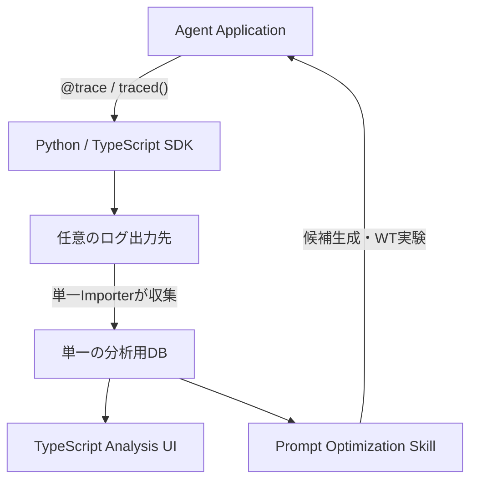
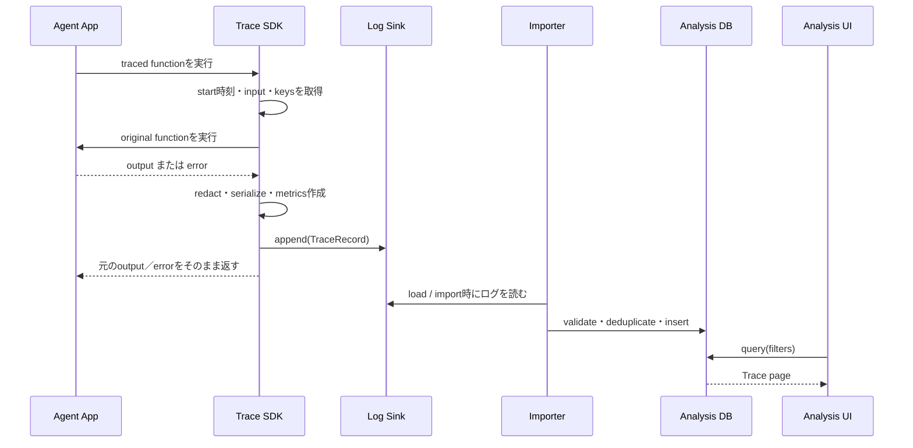
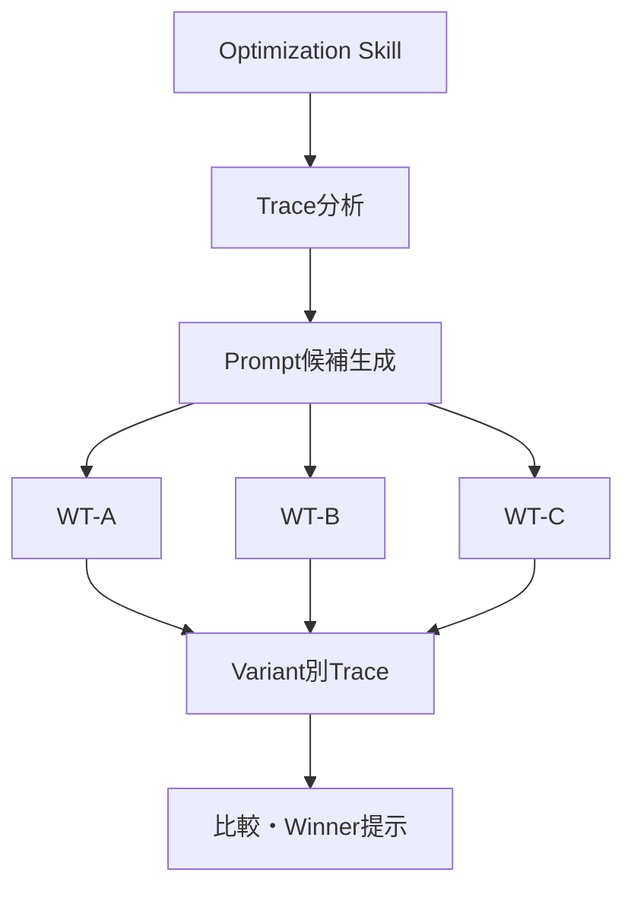

# PromptTrace 設計書

**Status:** Draft v0.1  
**Target:** OSS / Local-first  
**Primary language:** TypeScript（UI・TypeScript SDK）  
**Secondary language:** Python（Python SDK）  
**更新日:** 2026-09-22

---

## 1. 概要

PromptTraceは、AI Agent／LLMアプリケーションの実行結果を、極小の導入コストで記録・検索・比較するためのローカルファーストなTraceライブラリである。

利用者は対象関数へDecoratorまたはWrapperを付け、次の3点だけを指定する。

1. 共通Trace Schema
2. ログの出力先を実装するSink Adapter
3. 実験結果を検索・比較するための任意Key

PromptTrace本体はAgent Runtime、Prompt最適化、Git Worktree（以下WT）管理、並列実行を持たない。人間による分析は軽量なTypeScript UI、AIによる候補生成・WT並列実験・勝者選択は独立したCoding Agent Skillが担当する。



---

## 2. 解決する問題

AI Agentをバックボーンに持つWebアプリケーションでは、Promptを変更しても次の作業に時間がかかる。

- 変更前後の入力・出力を揃えて保存する
- 実験名、Prompt版、テストケース、モデル等で結果を探す
- 成功率、Score、Latency、Token、Costを比較する
- 失敗例を抽出して、次のPrompt候補を考える
- 複数候補を分離環境で実行して勝者を決める

既存Observability製品は高機能だが、Prompt実験だけを目的にすると、複数DB、Queue、Object Storage、Frontend、Backend等の依存が過大になりやすい。

PromptTraceは「記録・検索・比較」に限定し、OptimizerやAgent実行基盤を外部へ分離する。

---

## 3. ゴール

### 3.1 Product Goal

以下のループを、既存Agentアプリへの最小変更で短時間に回せるようにする。

```text
RUN → TRACE → FILTER → COMPARE → REWRITE → RUN
```

### 3.2 Functional Goals

- PythonとTypeScriptの両方から同一SchemaのTraceを保存できる
- 同期／非同期関数をDecoratorまたはWrapperで計測できる
- ログ出力先をSink Adapterで差し替えられる
- `load`／`import`コマンドでログを収集して単一の分析用DBへ登録できる
- 任意のKey-ValueでTraceを検索・Groupingできる
- Input、Output、Prompt、Tool Calls、Error、Metricsを保存できる
- 軽量なTypeScript UIでFilter、詳細確認、集計、Variant比較ができる
- Trace取得失敗が、既存アプリケーションを原則停止させない
- ネットワーク接続、Docker、外部サービスなしで利用できる

### 3.3 Non-functional Goals

- Core SDKは極小依存とする
- UIは単一ローカルプロセスで起動する。UI起動中のImportはUIプロセスが実行する
- デフォルトでは外部へデータを送信しない
- Python／TypeScript間でSchema互換性を保つ
- 保存データは人間が直接読めるJSONとしてExport可能にする
- Schema migrationは破壊的変更を避け、`schemaVersion`で管理する

---

## 4. Non-goals

V0では次を実装しない。

- Agent Runtime
- LLM Provider統合
- Prompt自動改善アルゴリズム
- LLM-as-a-Judgeの実装
- Git Worktree作成・削除・Merge
- 並列プロセス管理
- CI/CD orchestration
- Production向け分散Tracing
- Team、RBAC、SSO、監査ログ
- Cloud hosted service
- 大規模Telemetry基盤

WT並列化はPromptTraceライブラリではなく、Coding Agent Skillの責務とする。

---

## 5. 設計原則

### 5.1 CaptureとOptimizationを分離する

SDKは事実を記録する。Prompt改善の判断はUI上の人間、またはSkill上のCoding Agentが行う。

### 5.2 Searchable KeyとRich Payloadを分離する

- `keys`: 索引・Filter・Group Byに使用するスカラー値
- `artifacts`: Prompt、Input、Output、Tool Calls等の任意JSON
- `metrics`: 集計対象の数値

これにより、ログ出力先は単に保存すればよく、検索用索引は分析用DBで構築できる。

### 5.3 ログ出力先を決め打ちしない

Coreはログ出力用のSink Protocolだけを定義する。ログの保存先は任意。分析時にImportするローカルDBもAdapterで差し替えられ、V0の標準はDuckDBとする。

### 5.4 Appを壊さない

Trace保存失敗は既定で警告に留め、元の関数の戻り値・例外を変えない。厳格なテスト用途では`strict: true`を選べる。

### 5.5 UIとCoreを別Packageにする

Decoratorだけを使う利用者へ、Web ServerやChartライブラリを導入させない。

### 5.6 Cross-language互換性をSchemaで保証する

PythonとTypeScriptが互いの実装詳細へ依存しない。JSON SchemaとConformance Testを契約とする。

---

## 6. 全体Architecture

| Layer | 責務 | 実装 |
|---|---|---|
| Schema | 言語非依存のTrace契約 | JSON Schema |
| Python SDK | Decorator、Serialization、Redaction、Sink Protocol | Python |
| TypeScript SDK | Wrapper、Decorator、Serialization、Redaction、Sink Interface | TypeScript |
| Log sinks | 実行ログの出力 | JSONL、Memory、Custom |
| Importer + analysis store | ログの収集・登録・検索 | 単一DuckDBファイル（標準）、Custom |
| Analysis UI | Filter、集計、比較、詳細確認 | TypeScript + Hono JSX |
| Optimization Skill | Trace分析、Prompt候補、WT、実行、比較 | Coding Agent Skill |

### 6.1 Runtime Data Flow



---

## 7. 共通Trace Schema

### 7.1 TraceRecord

```ts
type JsonPrimitive = string | number | boolean | null
type JsonValue =
  | JsonPrimitive
  | JsonValue[]
  | { [key: string]: JsonValue }

type SearchValue = string | number | boolean

interface TraceRecord {
  schemaVersion: "1.0"
  id: string
  parentId?: string
  operation: string

  startedAt: string       // UTC ISO-8601
  endedAt: string         // UTC ISO-8601
  durationMs: number
  status: "ok" | "error"

  keys: Record<string, SearchValue>
  artifacts: Record<string, JsonValue>
  metrics: Record<string, number>

  error?: {
    type?: string
    message: string
    stack?: string
    data?: JsonValue
  }

  sdk: {
    language: "python" | "typescript"
    version: string
  }
}
```

### 7.2 Field Rules

| Field | Rule |
|---|---|
| `schemaVersion` | Schema互換性の判定に使う |
| `id` | SDKが生成するopaqueな一意ID。UUIDを推奨するが形式固定はしない |
| `parentId` | 入れ子のTraceを関連付けるOptional field |
| `operation` | 関数名または明示指定名 |
| `keys` | 検索用。値はstring／number／booleanのみ |
| `artifacts` | 非索引の任意JSON。大きなPayloadは制限対象 |
| `metrics` | 集計用数値。単位はKey名へ含める（例: `tokens.total`） |
| `error` | `status=error`時のみ原則設定 |

### 7.3 Well-known Keys

Schema上は任意だが、UIとSkillが初期設定なしで扱えるよう、次を推奨する。

| Key | 用途 |
|---|---|
| `experiment` | 一連の実験ID |
| `variant` | Prompt候補名／版 |
| `case` | 同じ入力をVariant間で対応付けるテストケースID |
| `prompt` | Prompt IDまたはPrompt version |
| `model` | 使用モデル |
| `environment` | local／test／staging等 |
| `git.commit` | 実行時Commit SHA |
| `git.branch` | Branch／WT識別 |

Well-known Keyは予約語ではない。利用者は別名を設定できる。

### 7.4 Well-known Artifacts

| Artifact | 内容 |
|---|---|
| `input` | 関数の引数、User input、Test fixture |
| `output` | Agent／LLM出力 |
| `prompt` | 実際に使用したPrompt snapshot |
| `messages` | Chat messages |
| `tools` | Tool definitions |
| `toolCalls` | Tool call trajectory |
| `expected` | Golden output／期待条件 |
| `evaluation` | Judge comment等の非数値評価 |

### 7.5 Well-known Metrics

| Metric | 単位 |
|---|---:|
| `score` | 0.0–1.0推奨 |
| `tokens.input` | token |
| `tokens.output` | token |
| `tokens.total` | token |
| `cost.usd` | USD |
| `latency.llm_ms` | ms |
| `tool_calls.count` | count |

`durationMs`はTrace全体の標準列なので、`metrics`への重複保存は不要とする。

### 7.6 Example

```json
{
  "schemaVersion": "1.0",
  "id": "9c45c2f5-82ac-4d41-8f6b-6c6d64a77d4d",
  "operation": "research_agent.run",
  "startedAt": "2026-09-22T03:10:01.120Z",
  "endedAt": "2026-09-22T03:10:02.952Z",
  "durationMs": 1832,
  "status": "ok",
  "keys": {
    "experiment": "exp-003",
    "variant": "planner-v4",
    "case": "tool-selection-07",
    "model": "model-a"
  },
  "artifacts": {
    "input": { "query": "..." },
    "output": { "answer": "..." },
    "prompt": { "system": "..." },
    "toolCalls": []
  },
  "metrics": {
    "score": 0.92,
    "tokens.input": 610,
    "tokens.output": 222,
    "tokens.total": 832,
    "cost.usd": 0.0041
  },
  "sdk": {
    "language": "typescript",
    "version": "0.1.0"
  }
}
```

---

## 8. SDK API

## 8.1 共通Behavior

Python／TypeScript SDKは次の順序で動作する。

1. Runtime keysを解決する
2. Inputをcaptureする
3. 元の関数を実行する
4. OutputまたはErrorをcaptureする
5. Redactionを適用する
6. JSON serializableな形式へ変換する
7. Payload size limitを適用する
8. Sinkへappendする
9. 元の戻り値または例外を変更せず返す

### Default Safety

- Sink errorは`strict=false`なら元処理へ影響させない
- `strict=true`ではログ出力失敗を例外にする
- 循環参照や非対応Objectは安全な文字列表現へFallbackする
- Error stack保存は設定で無効化できる
- Secret値は保存前に必ずRedactorを通す

---

## 8.2 Python SDK

### Public API

```python
from prompttrace import trace

@trace(
    sink=sink,
    operation="research_agent.run",
    keys={
        "experiment": "exp-003",
        "variant": "planner-v4",
    },
)
async def run_agent(query: str):
    return await agent.run(query)
```

Runtime値はcallableでも指定できる。

```python
@trace(
    sink=sink,
    keys=lambda args, kwargs: {
        "experiment": kwargs["experiment"],
        "case": kwargs["case_id"],
    },
    artifacts=lambda ctx: {
        "prompt": ctx.kwargs.get("prompt"),
    },
)
def run_case(query: str, *, experiment: str, case_id: str, prompt: str):
    return agent.run(query)
```

### Signature

```python
def trace(
    *,
    sink: SyncTraceSink | AsyncTraceSink,
    operation: str | None = None,
    keys: dict[str, SearchValue] | KeyResolver | None = None,
    artifacts: ArtifactResolver | None = None,
    metrics: MetricResolver | None = None,
    capture_input: bool = True,
    capture_output: bool = True,
    redactors: Sequence[Redactor] = (),
    max_payload_bytes: int = 1_000_000,
    strict: bool = False,
) -> Callable: ...
```

同期関数と`async def`の両方をサポートする。

---

## 8.3 TypeScript SDK

TypeScriptではHigher-order functionを必須APIとする。ECMAScript Decoratorはmethod用のOptional APIとして提供する。元関数の同期／非同期Semanticsを維持するため、同期関数には同期Sink、非同期関数には同期または非同期Sinkを使用する。

### Wrapper API

```ts
import { traced } from "@prompttrace/core"

const runAgent = traced(
  {
    sink,
    operation: "research_agent.run",
    keys: {
      experiment: "exp-003",
      variant: "planner-v4",
    },
  },
  async (query: string) => agent.run(query),
)
```

Runtime resolver:

```ts
const runCase = traced(
  {
    sink,
    keys: ({ args }) => ({
      experiment: args[1].experiment,
      case: args[1].caseId,
    }),
    artifacts: ({ args }) => ({
      prompt: args[1].prompt,
    }),
  },
  async (query: string, options: RunOptions) => agent.run(query),
)
```

### Method Decorator API

```ts
class ResearchAgent {
  @trace({ sink, operation: "research_agent.run" })
  async run(query: string) {
    // ...
  }
}
```

Decorator互換性問題があるRuntimeでは`traced()`を使用する。

### Signature

```ts
interface TraceOptions<Args extends unknown[], Result> {
  sink: SyncTraceSink | AsyncTraceSink
  operation?: string
  keys?: SearchKeys | ((ctx: BeforeContext<Args>) => SearchKeys)
  artifacts?: (ctx: TraceContext<Args, Result>) => JsonObject
  metrics?: (ctx: TraceContext<Args, Result>) => Record<string, number>
  captureInput?: boolean
  captureOutput?: boolean
  redactors?: Redactor[]
  maxPayloadBytes?: number
  strict?: boolean
}

function traced<Args extends unknown[], Result>(
  options: SyncTraceOptions<Args, Result>,
  fn: (...args: Args) => Result,
): (...args: Args) => Result

function traced<Args extends unknown[], Result>(
  options: AsyncTraceOptions<Args, Result>,
  fn: (...args: Args) => Promise<Result>,
): (...args: Args) => Promise<Result>
```

同期関数へ非同期Sinkを組み合わせる構成は、戻り値をPromiseへ変えてしまうため拒否する。非同期関数は同期Sinkまたは非同期Sinkを利用できる。

---

## 9. Context Propagation

親子Traceを明示できるよう、言語ごとの標準的なAsync Contextを使用する。

- Python: `contextvars`
- TypeScript: `AsyncLocalStorage`（Node Runtime）

Contextには次を保持する。

```ts
interface TraceContextState {
  traceId?: string
  inheritedKeys: Record<string, SearchValue>
}
```

利用例:

```ts
await withTraceContext(
  {
    experiment: "exp-003",
    variant: "planner-v4",
    case: "case-12",
  },
  () => runAgent(input),
)
```

明示指定Keyは継承Keyを上書きする。Context propagationは単一プロセス内のみをV0の対象とする。

---

## 10. Sink / Analysis Store Protocol

## 10.1 最小Contract

```ts
interface AsyncTraceSink {
  append(record: TraceRecord): Promise<void>
}

interface SyncTraceSink {
  append(record: TraceRecord): void
}

interface AnalysisStore {
  insertBatch(records: TraceRecord[]): Promise<ImportResult>
  get(id: string): Promise<TraceRecord | null>
  query(query: TraceQuery): Promise<TracePage>
}
```

Python側も同義の`Protocol`を定義する。

```python
class SyncTraceSink(Protocol):
    def append(self, record: TraceRecord) -> None: ...

class AsyncTraceSink(Protocol):
    async def append(self, record: TraceRecord) -> None: ...
```

両SDKで同期Sinkと非同期Sinkを別Contractとして定義する。同期関数は同期Sinkのみ、非同期関数は両方を利用できる。検索・集計はAnalysisStoreだけの責務であり、DecoratorからDBへ直接アクセスしない。非同期関数から同期Sinkへ書く場合、V0は短時間のローカル出力を前提とする。

## 10.2 TraceQuery

```ts
interface TraceQuery {
  keys?: Record<string, SearchValue | SearchValue[]>
  status?: "ok" | "error"
  operation?: string | string[]
  startedAfter?: string
  startedBefore?: string
  metricRanges?: Record<string, { gte?: number; lte?: number }>
  text?: string
  orderBy?: "startedAt" | "durationMs"
  order?: "asc" | "desc"
  limit?: number
  cursor?: string
}

interface TracePage {
  items: TraceRecord[]
  nextCursor?: string
}
```

`cursor`は分析用Store固有のopaque valueとし、UIは内容を解釈しない。

## 10.3 Optional Capabilities

高効率なUIを実装できるAdapterは、次を追加実装できる。

```ts
interface FacetCapableStorage {
  facets(query: TraceQuery, keys: string[]): Promise<FacetResult>
}

interface AggregateCapableStorage {
  aggregate(query: TraceQuery, request: AggregateRequest): Promise<AggregateResult>
}
```

未実装の場合、UIは取得済みTraceをローカル集計する。V0の必須Contractには含めない。

---

## 11. 標準Log Sink／Analysis Store

### 11.1 MemorySink

- テスト用
- 外部依存なし
- Process終了時に消える

### 11.2 JSONLSink

- 最も単純な永続化
- append-only
- Git diff、Export、Debugに向く
- 大量検索には不向き

### 11.3 DuckDBAnalysisStore

- ImporterとローカルUIの標準分析用DB（単一ファイル）
- 実行中のSDKは直接書き込まず、Import時にまとめて投入する
- `experiment`／`variant`／`case`別集計に使用する
- 外部Server不要
- 単一プロセスがDBの書き込みを所有する

### 11.4 Custom Adapter

利用者は任意ログ出力先のSinkや、別の分析用Storeを実装できる。Core SDKはDuckDBに依存しない。

---

## 12. DuckDB Physical Schema

任意KeyとMetricをJSON内だけに保存するとFilter／集計が難しいため、DuckDB AnalysisStoreは検索用値を別表でも保持する。Record全体の正本は`record_json`とする。実装時はDuckDBのJSON型、型別カラム、索引の有効性を計測し、以下を論理スキーマとして具体化する。

```sql
CREATE TABLE traces (
  id              TEXT PRIMARY KEY,
  schema_version  TEXT NOT NULL,
  parent_id       TEXT,
  operation       TEXT NOT NULL,
  started_at      TEXT NOT NULL,
  ended_at        TEXT NOT NULL,
  duration_ms     REAL NOT NULL,
  status          TEXT NOT NULL,
  record_json     TEXT NOT NULL
);


CREATE TABLE trace_keys (
  trace_id        TEXT NOT NULL,
  key             TEXT NOT NULL,
  value_type      TEXT NOT NULL,
  value_text      TEXT,
  value_number    REAL,
  value_boolean   INTEGER,
  PRIMARY KEY (trace_id, key),
  FOREIGN KEY (trace_id) REFERENCES traces(id)
);


CREATE TABLE trace_metrics (
  trace_id        TEXT NOT NULL,
  key             TEXT NOT NULL,
  value_number    REAL NOT NULL,
  PRIMARY KEY (trace_id, key),
  FOREIGN KEY (trace_id) REFERENCES traces(id)
);

```

Importはbatch単位でTransactionを張る。重複した`id`はSkipし、同じソースを再Importしても重複させない。

V0のMigrationは`schema_migrations`テーブルで管理する。

---

## 13. TypeScript Analysis UI

## 13.1 技術選定

| 項目 | 選定 | 理由 |
|---|---|---|
| Local server | Hono | TypeScript中心、軽量、SSR可能 |
| Rendering | Hono JSX / SSR | SPA buildと大型Frontend runtimeを避ける |
| Client interaction | 小規模TypeScript | Filter、Drawer、Compare選択のみ |
| Chart | uPlot（Optional） | Score、Latency、Token推移に十分 |
| Styling | 静的CSS | UI framework依存を避ける |
| Data source | AnalysisStore | DuckDBへUIを密結合させない |

UIは`localhost`へbindし、デフォルトでは外部Networkへ公開しない。通常の画面は読み取り専用。Import APIだけは、起動中のUIプロセスをDBの単一所有者にするための限定的な書き込み入口とする。

> **V0.2実装メモ:** 現行のUIは`packages/ui/python`（Flask + 既存の`DuckDBAnalysisStore`）で実装している。Node/DuckDBドライバの安定性が低いことと、Import・分析がPython側にあるため。UIは`AnalysisStore`contract（`query`/`get`）だけに依存しており、将来のTS/Hono実装へ差し替え可能。

## 13.2 Package Boundary

```bash
npm install @prompttrace/core
npm install @prompttrace/duckdb
npm install @prompttrace/ui
```

Core利用者にはHono、DuckDB driver、uPlotを導入しない。

## 13.3 Information Architecture

V0は1つのApplication shellと3つのViewで構成する。

### Explorer

- KeyによるFilter
- Operation、Status、期間によるFilter
- Trace一覧
- Input／Output／Prompt／Tool Calls／Error／Raw JSON表示
- JSONコピー

### Compare

- Experiment内のVariant比較
- `case`によるPairing
- Count、Success rate、平均Score、p50/p95 Latency、Tokens、Cost
- Baselineとの差分
- Input／Output／Promptの横並び表示

### Trends

- Score、Latency、Tokens、Costの時系列
- Prompt versionまたはVariant別の系列
- V0ではTableを必須、ChartはOptional

## 13.4 Primary Screen

```text
┌──────────────────────────────────────────────────────────────┐
│ PromptTrace  Store: local.db                                 │
│ Experiment [exp-003] Variant [All] Case [All] Status [All]   │
├──────────────────────────────────────────────────────────────┤
│ Variant   Runs   Success   Avg score   p50 ms   Tokens  Cost │
│ v3         50      92%       .82        1210      812   .20  │
│ v4         50      96%       .91        1090      844   .22  │
├──────────────────────────────────────────────────────────────┤
│ Traces                                                       │
│ □ ID       Case       Variant  Score  Latency  Tokens Status │
│ □ ...      case-01    v4       .94    1.1s     821    OK     │
├──────────────────────────────────────────────────────────────┤
│ Selected: Input | Output | Prompt | Tools | Error | Raw      │
└──────────────────────────────────────────────────────────────┘
```

## 13.5 UI Configuration

UIは任意Keyを扱えるが、比較画面の意味を決めるため設定を持つ。

```json
{
  "schemaVersion": "1",
  "storage": {
    "kind": "duckdb",
    "path": ".prompttrace/analysis.duckdb"
  },
  "analysis": {
    "experimentKey": "experiment",
    "variantKey": "variant",
    "caseKey": "case",
    "primaryMetric": "score",
    "visibleMetrics": [
      "score",
      "tokens.total",
      "cost.usd"
    ]
  }
}
```

Custom analysis storeはコードから`createViewer({ store })`を呼び出す。

```ts
import { createViewer } from "@prompttrace/ui"

const app = createViewer({
  store,
  analysis: {
    experimentKey: "experiment",
    variantKey: "variant",
    caseKey: "case",
    primaryMetric: "score",
  },
})
```

## 13.6 UI Commands

```bash
prompttrace-ui --db .prompttrace/analysis.duckdb
prompttrace-ui --config prompttrace.config.json
```

V0の画面はread-onlyとする。Import APIは許可済みソースの取込専用であり、Score追加、Annotation、Prompt編集はV1候補とする。

---

## 14. Prompt Optimization Skill

## 14.1 Positioning

WT並列化はSDKやUIに実装せず、Codex／Claude Code等が利用するSkillとして提供する。

SkillはPromptTraceのTraceを読み、既存RepositoryのTest commandを使って実験を編成する。



## 14.2 Skill Responsibilities

1. Baseline Promptと関連コードを特定する
2. 過去Traceから低Score、Error、代表的Failureを抽出する
3. Failure clusterと改善仮説を作る
4. Prompt候補を複数生成する
5. CandidateごとにGit Worktreeを作る
6. Candidate Promptだけを各WTで変更する
7. 同じTest casesを実行する
8. `experiment`、`variant`、`case`をTrace keysへ設定する
9. Score、Error、Latency、Token、Costを比較する
10. Winner、根拠、Regression、未解決Failureを提示する
11. 人間の承認後のみ本Branchへ反映する

## 14.3 Skill Non-responsibilities

- SDK内部のTrace format変更
- Sink／AnalysisStore Adapter実装
- UI rendering
- Agent Runtime実装
- 自動Merge
- Production Promptの無承認変更

## 14.4 Log Collection / Import

Agent実行と分析用DBへの登録は独立した処理である。各WTは設定したログ出力先へTraceを記録するだけで、分析用DBを開かない。ログが別ファイル・別リソースにあっても分析用DBは1つにする。各WTで別DBを作る必要はない。

```text
WT-A → log-a.jsonl ─┐
WT-B → log-b.jsonl ─┼→ load/import → analysis.duckdb → UI
WT-C → log-c.jsonl ─┘
```

```bash
prompttrace import --source .prompttrace/logs/ --db .prompttrace/analysis.duckdb
prompttrace load --source .prompttrace/logs/ --db .prompttrace/analysis.duckdb
```

`load`は`import`の別名とする。Importerは指定リソースからTraceを読み、Schema検証、Redaction済みデータの確認、`id`による重複排除、batch登録を行う。入力ファイルは読み取り後も保持し、再実行可能にする。Importの実行単位は原則1プロセスとし、エージェントによる並列Importは行わない。

DuckDBの通常のファイル利用では、UI（別プロセス）が同じファイルを開いている間、別プロセスのCLI Importerは書き込まない。UI停止中はCLIが直接Importできる。UI起動中は同じコマンドをUIのローカルImport APIへ送ってUIプロセスに処理させる（またはUIを閉じてImportする）。HTTP APIはlocalhost限定とし、任意パスを受け取らない。Importerは明示許可されたsourceのみを読む。

この制約はAgentの並列実行数やTrace件数に起因するものではなく、DuckDBファイルを別プロセスが開く場合の所有ルールである。DuckDB公式：[Concurrency](https://duckdb.org/docs/current/connect/concurrency)、[JSON Import](https://duckdb.org/docs/current/guides/file_formats/json_import)、[Node.js Client (Neo)](https://duckdb.org/docs/current/clients/node_neo/overview)。

## 14.5 Environment Contract

Skillは既存Test runnerへ次の環境変数を渡せる。

```text
PROMPTTRACE_EXPERIMENT=exp-003
PROMPTTRACE_VARIANT=variant-a
PROMPTTRACE_LOG_DEST=.prompttrace/logs/exp-003/variant-a.jsonl
PROMPTTRACE_GIT_COMMIT=<sha>
```

SDKはEnvironmentを暗黙に全取得しない。利用者の設定またはhelperで、許可された値だけをkeysへ写す。

---

## 15. Package Structure

```text
prompttrace/
├── schemas/
│   ├── trace-record.schema.json
│   └── fixtures/
│
├── packages/
│   ├── core/
│   │   ├── python/           # Python SDK (@trace)
│   │   └── typescript/       # TypeScript SDK (traced() / @trace)
│   ├── importer/
│   │   └── python/           # prompttrace-importer CLI + DuckDB analysis store
│   ├── sink-jsonl/           # 今後追加
│   ├── analysis-duckdb/      # 今後追加
│   └── ui/                   # Analysis UI（V0.2は Python/Flask）
│
├── skills/
│   └── prompt-optimization/  # WT orchestration Skill
│
├── conformance/
│   ├── typescript/
│   ├── python/
│   └── expected/
│
├── examples/
│   ├── typescript-agent/
│   └── python-agent/
│
└── README.md
```

### Proposed Package Names

| Artifact | Name |
|---|---|
| TypeScript core | `@prompttrace/core` |
| Analysis store | `@prompttrace/duckdb` |
| Importer CLI | `@prompttrace/importer` |
| TypeScript UI | `@prompttrace/ui` |
| Python SDK | `prompttrace` |
| CLI | `prompttrace-ui` |

実装前にnpm／PyPI／GitHub上の名称衝突を確認する。

---

## 16. Dependency Policy

### TypeScript Core

- Runtime dependencies: 原則0
- Node built-insを優先
- Validation libraryはBuild-time生成またはOptionalとする

### Python Core

- 標準ライブラリ中心
- Schema validationはOptional dependencyとする
- SDKはDuckDBへ依存しない

### UI

- `hono`
- `uplot`はChartを有効にした場合のみ
- Frontend framework、state management library、大型component suiteはV0で導入しない

### DuckDB TypeScript Analysis Store

UIとImporterはDuckDBのNode.js Client（Neo）の採用を検討する。Core SDKには含めず、配布サイズはUI／Importer側だけで評価する。

---

## 17. Serialization・Redaction・Size Limit

## 17.1 Serializer

SDKは次の順でJSON化する。

1. 利用者定義Serializer
2. 標準JSON serializer
3. 既知型の変換（日付、Enum等）
4. 安全な文字列表現

Binary、File handle、Socket、巨大Objectはデフォルトで内容を保存せず、型と要約だけを保存する。

## 17.2 Redaction

標準Redactor:

- Key name match: `authorization`, `api_key`, `token`, `password`, `cookie`
- Regex match
- JSON path match
- 利用者定義callback

RedactionはSinkへ渡す前に適用する。UI側Redactionだけに依存しない。

## 17.3 Payload Limit

- 既定: 1 MB / Trace（設定可能）
- 超過時: artifact単位でtruncateし、`artifacts._prompttrace.truncated`へ記録
- `keys`と`metrics`はtruncate対象外だが、Key数上限を設ける

推奨上限:

- keys: 64
- metrics: 128
- key name: 128文字

---

## 18. Error Semantics

| Failure | `strict=false` | `strict=true` |
|---|---|---|
| 元関数が例外 | Trace保存後、元例外を再throw | 同左 |
| Serialization失敗 | Fallback表現で保存 | Trace errorをthrow |
| Sink append失敗 | Hook／Loggerへ通知し、元結果を返す | Sink errorをthrow |
| Redactor失敗 | 安全のため該当artifactをdrop | Errorをthrow |
| Payload超過 | truncateして保存 | 設定によりthrow可能 |

元関数の例外とTrace保存例外が同時に発生した場合、元関数の例外を優先し、Trace失敗を補助情報として通知する。

---

## 19. Security・Privacy

- デフォルトbindは`127.0.0.1`
- UIに外部CDNを使わず、assetはPackageへ同梱する
- Telemetryは実装しない、または明示Opt-inのみとする
- Raw Prompt／Input／Outputには機密情報が含まれる前提で設計する
- Redactionは保存前に行う
- DB file permissionを可能な範囲でOwner-onlyにする
- UIはV0でwrite APIを公開しない
- `--host 0.0.0.0`利用時は警告を表示する
- Productionデータ保存は利用者の責任範囲をREADMEで明記する

---

## 20. Performance・Scale Target

V0は個人開発・小規模TeamのローカルPrompt実験を対象とする。

想定:

- 1 Storeあたり最大10万Trace程度
- Trace一覧はcursor pagination
- UI初期表示は100件以下
- Aggregate capabilityがないStoreでは、UIのローカル集計件数に上限を設ける
- Importerがbatch単位でDuckDBへ書く

分散Write、数千万Trace、長期Production observabilityは対象外とする。

---

## 21. Testing Strategy

### 21.1 Schema Conformance

同じFixtureに対してPython／TypeScriptが同一意味のJSONを生成することを確認する。

### 21.2 SDK Tests

- sync／async成功
- sync／async例外
- static keys／runtime keys
- input／output capture on/off
- nested traceとparentId
- redaction
- circular reference
- payload truncation
- strict／best-effort
- storage failure

### 21.3 Sink / AnalysisStore Contract Tests

全Adapterへ共通Test suiteを適用する。

- append → get
- key完全一致
- 複数Key AND検索
- metric range
- status／operation／time range
- pagination
- type preservation（`"1"`と`1`を区別）

### 21.4 Cross-language Import Tests

- Python SDKで出力したTraceをImportし、TypeScript UIで読む
- TypeScript SDKで出力したTraceをImportし、TypeScript UIで読む
- 同じログのImport再実行で件数が増えない
- UI起動中のImportはUI所有プロセス経由で行う
- Migration version一致

### 21.5 UI Tests

- Filter query生成
- Variant集計
- case pairing
- Baseline diff
- Large JSON rendering
- malformed recordの安全な表示

### 21.6 Skill Dry Run

- 仮Repositoryで3 Variantを生成
- WTごとにログを出力し、単一DBへ順次Importする
- 同一case setを実行
- Winner reportを生成
- 人間承認なしでMergeしない

---

## 22. MVP Scope

### V0.1: Capture

- JSON Schema 1.0
- TypeScript `traced()`
- Python `@trace`
- MemoryStorage
- JSONLStorage
- Redaction
- Conformance fixtures

### V0.2: Local Analysis

- DuckDB AnalysisStoreと`load`／`import`コマンド
- TypeScript Analysis UI
- Key filter
- Trace detail
- Variant summary table
- Case pairing comparison
- CLI起動

### V0.3: Skill

- Prompt Optimization Skill
- Failure sampling
- Candidate generation
- WTのログ出力先の設定
- Variant別test execution
- Winner report

Chart、自動Judge、Annotation、Prompt editorはMVP後に判断する。

---

## 23. Acceptance Criteria

MVP完了条件:

1. Python／TypeScriptの各Agent関数へ10行以内の追加でTraceを導入できる
2. 両SDKのログが共通Schemaで単一DuckDBへImportできる
3. 任意の`experiment`、`variant`、`case`で検索できる
4. UIを1 commandでlocalhost起動できる
5. UIでBaselineとCandidateのScore、Error、Latency、Token、Costを比較できる
6. 1件のTraceについてInput、Output、Prompt、Tool Calls、Error、Raw JSONを確認できる
7. UIを導入しなくてもCore SDKだけを利用できる
8. ログ出力先の障害時も既定ではAgent処理を壊さない
9. Skillが複数WTのログを出力し、単一分析用DBで比較できる
10. Skillが自動Mergeせず、Winnerと根拠を提示して停止する

---

## 24. 主要Decision

| Decision | 採用 | 理由 |
|---|---|---|
| SDK言語 | Python + TypeScript | 対象Agentアプリを広くカバー |
| UI言語 | TypeScript | Web UIとの親和性、単一言語でServer／Client実装 |
| UI方式 | Hono JSX SSR | React SPAを避け、依存とbuildを抑える |
| 標準Local DB | DuckDB | Server不要、後段の一括取込・比較集計に適合 |
| ログ出力先 | 固定しない | 任意リソースを許容するため |
| Search schema | scalar keys | Adapter実装と索引を単純化 |
| Rich data | artifacts JSON | Prompt／Tool Call等の変化へ耐える |
| Optimizer | Coreに入れない | Captureと判断を分離するため |
| WT管理 | Skill | Agent orchestrationをLibraryから分離するため |
| UI編集 | V0では不可 | Viewerを小さく安全に保つため |

---

## 25. 実装前に残るDecision

優先度順:

1. OSS／npm／PyPIで利用する正式名称
2. TypeScript DuckDB client（UI／Importer用）
3. Python Sinkを同期／非同期のどちらをPrimaryにするか
4. Method DecoratorをV0へ含めるか、`traced()`のみから始めるか
5. uPlotをV0へ含めるか、集計Tableだけで開始するか
6. UIからScore／Annotationを追記する機能をV1へ入れるか

推奨初期判断:

- TypeScriptは`traced()`から開始し、DecoratorはV0.2以降
- UIはChartなしの集計Tableから開始
- Pythonは同期SinkをPrimaryとし、async関数内の保存方法を実装Spikeで計測
- DuckDB clientは独立AnalysisStoreへ隔離し、Core SDKの依存にしない

---

## 26. 最初の実装順序

1. `trace-record.schema.json`を確定
2. Cross-language fixtureを10件作る
3. TypeScript `traced()` + MemorySinkを実装
4. Python `@trace` + MemorySinkを実装
5. 共通Sink／AnalysisStore contract testsを作る
6. JSONL Adapterを両言語で実装
7. DuckDB physical schema、Migration、単一Importerを実装
8. TypeScript UIのExplorerを実装
9. Compare集計とcase pairingを実装
10. Prompt Optimization Skillを別Packageとして作る

この順序により、UIやSkillを作る前に、製品の中核である共通SchemaとSDK互換性を固定できる。

---

## 27. 一文での製品定義

> PromptTraceは、Python／TypeScriptのAgent実行をDecoratorで任意のログ出力先へ記録し、単一DuckDBへImportしてTypeScript UIとCoding Agent Skillで比較・改善できる、軽量なPrompt実験基盤である。
